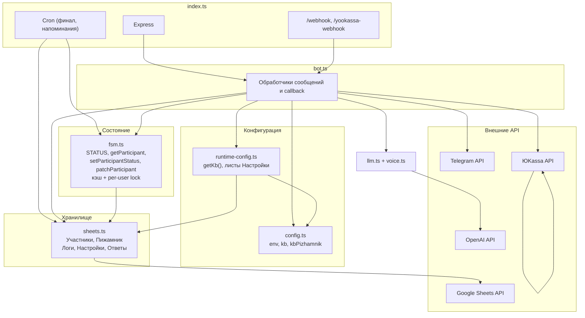

# Архитектура бота «Орлятник 21+ / Пижамник»

## Общая схема

```
┌─────────────────────────────────────────────────────────────────────────────────┐
│                              ВНЕШНИЕ СЕРВИСЫ                                      │
├──────────────┬──────────────┬──────────────┬──────────────┬──────────────────────┤
│   Telegram   │ Google       │   OpenAI    │   ЮKassa    │   (env: BOT_TOKEN,   │
│   Bot API    │ Sheets API   │   API       │   API       │    SHEET_ID, keys…)   │
└──────┬───────┴──────┬───────┴──────┬───────┴──────┬──────┴──────────────────────┘
       │             │              │              │
       ▼             ▼              ▼              ▼
┌──────────────────────────────────────────────────────────────────────────────────┐
│  index.ts — точка входа                                                            │
│  • Express: /webhook (Grammy), /yookassa-webhook, /health                         │
│  • Long-poll или webhook для Telegram                                              │
│  • Cron: финальные сообщения (каждые 2 мин), напоминания (ежедневно), остаток П.   │
└──────────────────────────────────────────────────────────────────────────────────┘
       │
       ▼
┌──────────────────────────────────────────────────────────────────────────────────┐
│  bot.ts — логика бота (createBot)                                                  │
│  • Обработка: текст, голос (→ транскрипт), фото/документ (чек), callback_query     │
│  • Две ветки: Орлятник / Пижамник (event); выбор мероприятия → меню → анкета →     │
│    выбор способа оплаты (перевод / ЮKassa) → чек → подтверждение админом           │
│  • Админ-меню: статистика, рассылка, настройки (редакт. ключей в таблице),         │
│    подтверждение оплаты по чекам                                                    │
└──────┬──────────────┬──────────────┬──────────────┬──────────────┬─────────────────┘
       │              │              │              │              │
       ▼              ▼              ▼              ▼              ▼
┌──────────┐  ┌──────────────┐  ┌─────────┐  ┌──────────┐  ┌─────────────┐
│  config  │  │runtime-config│  │  fsm.ts  │  │ sheets   │  │ llm + voice │
│  env, kb │  │ getKb(event) │  │ статусы │  │ Участники│  │ OpenAI      │
│  defaults│  │ лист Настройки│  │ кэш+lock│  │ Пижамник │  │ ответы/форма│
└──────────┘  └──────────────┘  └────┬────┘  └────┬─────┘  └─────────────┘
                                     │            │
                                     └────────────┘
                                     FSM читает/пишет
                                     участников через sheets
```

## Модули и зависимости



## Данные (Google Таблица)

| Лист | Назначение |
|------|------------|
| **Участники** | Участники Орлятника (user_id, status, анкета, event=orlyatnik). При смене на Пижамник строка переносится в «Пижамник». |
| **Пижамник** | Участники Пижамника. При смене на Орлятник строка переносится в «Участники». |
| **Настройки** | Ключ–значение для Орлятника (даты, тексты, AVAILABLE_SHIFTS, реквизиты и т.д.). |
| **Настройки Пижамник** | То же для Пижамника. |
| **Ответы** | База готовых ответов (вопрос → ответ) для getAnswerFromStorage / saveAnswer. |
| **Логи** | appendLog: timestamp, user_id, status, direction, message_type, text_preview. |

## Поток данных по участнику

1. **Сообщение от пользователя** → `bot.ts` определяет `event` (или выбор мероприятия).
2. **getParticipant(userId, …)** → FSM: кэш или `getOrCreateUser` / `getParticipantByUserId` из Sheets (поиск в Участники, затем Пижамник).
3. По **status** (NEW, INFO, FORM_FILLING, FORM_CONFIRM, WAIT_PAYMENT, PAYMENT_SENT, CONFIRMED, WAITLIST) выбирается ответ: меню, анкета, реквизиты, ЮKassa-ссылка, «пришли чек», «ты в списке» и т.д.
4. **Обновление** → `patchParticipant` / `setParticipantStatus` → FSM (lock) → `updateUserFields` в Sheets; при смене event — перенос строки между листами Участники ↔ Пижамник.
5. **Текст/вопрос** без явного шага → база «Ответы» (нормализованный вопрос) или LLM (getSalesReply / reviveAnswer).
6. **Чек (фото/документ)** в WAIT_PAYMENT → уведомление админу, статус PAYMENT_SENT; админ подтверждает → CONFIRMED, пользователю — «Ты в списке!» (или cron доставляет финальное сообщение).
7. **ЮKassa**: создание платежа (createPayment) → ссылка пользователю; webhook `payment.succeeded` → handleYooKassaWebhook → PAYMENT_SENT, уведомление админу.

## Статусы (FSM)

```
NEW → INFO (выбор мероприятия)
INFO ↔ FORM_FILLING (забронировать / вернуться в меню)
FORM_FILLING → FORM_CONFIRM (анкета заполнена)
FORM_CONFIRM → WAIT_PAYMENT (подтвердил анкету, выбрал способ оплаты)
WAIT_PAYMENT → PAYMENT_SENT (чек прислан или оплата через ЮKassa)
PAYMENT_SENT → CONFIRMED (админ нажал «Подтвердить оплату»)
INFO → WAITLIST (Пижамник: места кончились, запись в лист ожидания)
```

Конкретное дерево диалога и кнопки описаны в [dialog-flow.md](dialog-flow.md).
