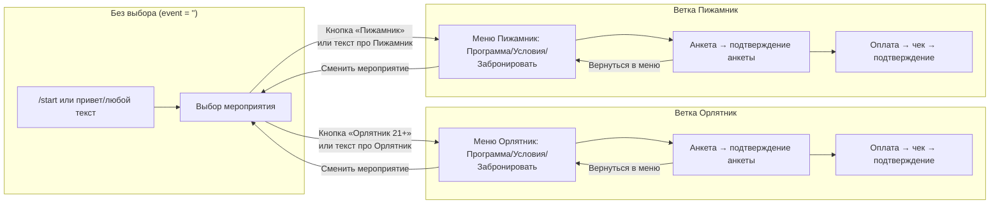

# Дерево диалога бота «Орлятник 21+ / Пижамник»

## Общая схема (упрощённо)



**Важно:**

- Пока `event === ''` бот **не отвечает по сути** на вопросы про даты/цену/программу, а просит сначала выбрать мероприятие (кнопкой или текстом).
- После выбора «Орлятник 21+» или «Пижамник» пользователь попадает в **своё** меню мероприятия. Текст (программа, условия, стоимость, даты) берётся из соответствующей таблицы.
- Кнопка «Сменить мероприятие» обнуляет `event` и возвращает к выбору [Орлятник 21+] / [Пижамник].

---

## Ветка: бронирование места

После нажатия «Забронировать место» (или фраза «хочу забронировать»):

```
  [Забронировать] / «хочу забронировать»
                    │
                    ▼
         ┌──────────────────────┐
         │ Согласие на ОПД      │
         │ [Согласен на ОПД]     │
         └──────────┬───────────┘
                    │
                    ▼
         ┌──────────────────────┐
         │ Анкета (по полям):   │
         │ ФИО → город → ДР →   │
         │ с кем едешь → телефон│
         │ комментарий → смена  │
         │ (кнопки смен при смене)│
         └──────────┬───────────┘
                    │
                    ▼
         ┌──────────────────────┐
         │ Проверь анкету:      │
         │ [текст анкеты]       │
         │ [Да] [Подтверждаю]   │
         └──────────┬───────────┘
                    │
                    ▼
         ┌──────────────────────┐
         │ Реквизиты для задатка│
         │ + повтор анкеты      │
         │ «Пришли чек сюда»    │
         └──────────┬───────────┘
                    │
                    ▼
         ┌──────────────────────┐
         │ Пользователь присылает│
         │ фото/документ чека   │
         └──────────┬───────────┘
                    │
                    ▼
         ┌──────────────────────┐
         │ Чек принят, ждём     │
         │ подтверждения        │
         │ (менеджер кнопкой)   │
         └──────────┬───────────┘
                    │
                    ▼
         ┌──────────────────────┐
         │ Ты в списке!         │
         │ Чат + контакт менеджера│
         └──────────────────────┘
```

---

## Состояния (статусы) участника

| Статус         | Когда показываем |
|----------------|-------------------|
| NEW / INFO     | Нет мероприятия (выбор Орлятник/Пижамник) или меню мероприятия, ответы на вопросы, «хочу забронировать» → согласие |
| FORM_FILLING   | Заполнение полей анкеты по очереди |
| FORM_CONFIRM   | «Проверь анкету» + кнопки Да/Подтверждаю |
| WAIT_PAYMENT   | Реквизиты + «пришли чек» |
| PAYMENT_SENT   | «Чек принят, ждём подтверждения» |
| CONFIRMED     | «Ты в списке!» + чат и менеджер |

---

## Точки входа по типам сообщений

| Действие пользователя | Реакция бота |
|------------------------|--------------|
| **/start**             | Всегда: яркое приветствие + выбор мероприятия [Орлятник 21+] [Пижамник] (event не задан) |
| **Привет/здравствуйте** (при event = '') | То же, что /start: общее приветствие и выбор мероприятия |
| **Текст с явным упоминанием мероприятия** (при event = '') | «орлятник…» → event = orlyatnik, «пижамник…» → event = pizhamnik, сразу показывается меню выбранного мероприятия |
| **Кнопка Орлятник/Пижамник** | Сохраняем event, показываем меню: [Программа] [Условия] [Забронировать] [Сменить мероприятие] |
| **Кнопка Сменить мероприятие** | Обнуляем event, статус переводим в NEW, показываем выбор: [Орлятник 21+] [Пижамник] |
| **Кнопка Узнать программу**  | Своё описание программы выбранного мероприятия + меню |
| **Кнопка Условия и стоимость** | Своя стоимость и даты выбранного мероприятия + меню |
| **Кнопка Забронировать**     | Если нет согласия → согласие; иначе → начало анкеты (выбор смены/даты по мероприятию) или лист ожидания |
| **Текст «хочу забронировать»** | То же, что кнопка «Забронировать» |
| **Текст «Да» / «Подтверждаю»** (на шаге анкеты) или кнопки [Да][Подтверждаю] | Переход к оплате: реквизиты + «пришли чек» |
| **Фото/документ** (в WAIT_PAYMENT) | Чек принят → PAYMENT_SENT, уведомление админу |
| **Голосовое / произвольный текст** | LLM-ответ или подсказка по текущему шагу, в пределах выбранного мероприятия |

---

## Админ-ветка

- **/start** или **/admin** (для admin chat_id) → админ-меню.
- Кнопки: статистика, рассылка, настройки, подтверждение оплаты по чекам.

---

---

## Настройки из таблицы (даты, программа, стоимость)

Тексты и даты мероприятий берутся из Google Таблицы:

- **Орлятник 21+** — лист **«Настройки»**: колонка A = ключ, колонка B = значение.
- **Пижамник** — лист **«Настройки Пижамник»**: то же формат.

Ключи, связанные с датами (подставляются в приветствия, программу, условия):

| Ключ | Пример значения |
|------|------------------|
| `DATES` | Заезд 21 марта в 14:00, выезд 22 марта в 14:00. |
| `NEXT_SHIFT_TEXT` | 21–22 марта |
| `AVAILABLE_SHIFTS` | 25 февраля, 1 марта (тест) |
| `DEFAULT_SHIFT` | 1 марта (тест) |
| `START_MESSAGE` | Краткое приветствие после выбора мероприятия |
| `PROGRAM_TEXT` | Полное описание программы |
| `CONDITIONS_TEXT` | Стоимость, условия, даты |

Если в таблице есть строка с ключом, бот использует её значение вместо значения из кода. Админ может менять эти ключи через бота (Настройки → выбрать мероприятие → нужный пункт).

---

*Логика: /start всегда показывает приветствие и выбор мероприятия. В меню мероприятия есть возврат к выбору (Сменить мероприятие). У каждого мероприятия свои даты, описание программы и стоимость — из таблицы.*
