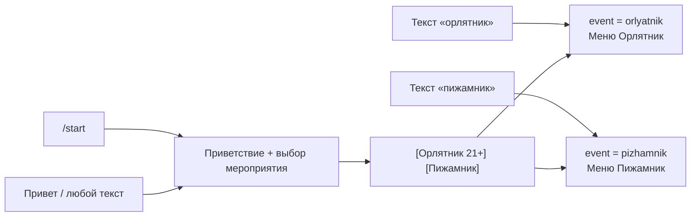
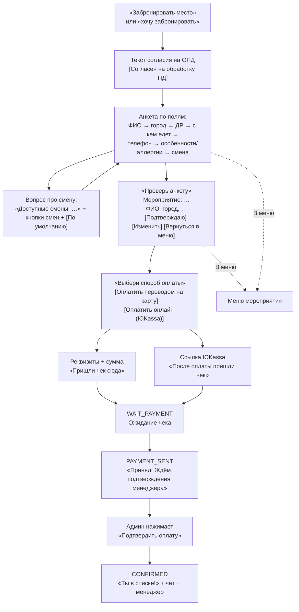
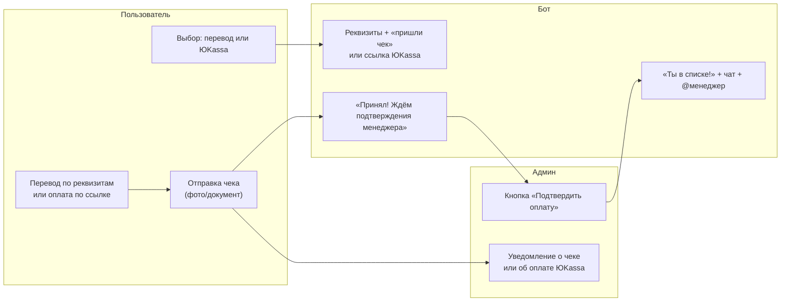
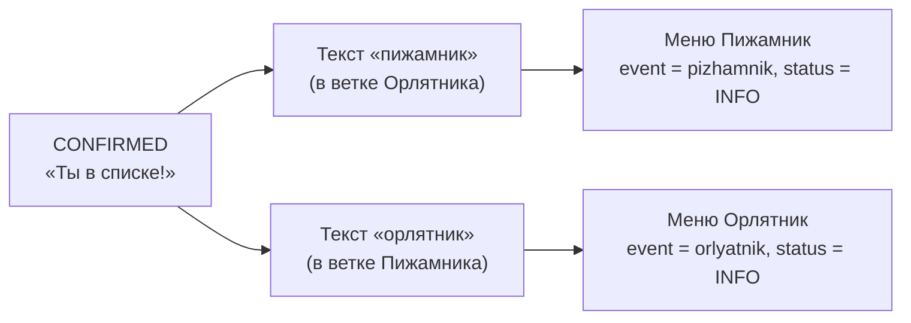

# Дерево диалога бота «Орлятник 21+ / Пижамник»

Полная актуальная схема: две независимые ветки (Орлятник / Пижамник), выбор мероприятия, анкета, выбор способа оплаты, чек, подтверждение админом.

---

## 1. Общая схема (верхний уровень)

```mermaid
flowchart TB
  subgraph noEvent ["Без выбора мероприятия (event = '')"]
    Start["/start или привет / любой текст"]
    Choice["Выбор мероприятия\n[Орлятник 21+] [Пижамник]"]
    Start --> Choice
  end

  subgraph orlyatnik ["Ветка Орлятник"]
    OMenu["Меню: Программа | Условия | Забронировать | Сменить мероприятие"]
    OConsent["Согласие на ОПД"]
    OForm["Анкета (7 полей)"]
    OConfirm["Проверь анкету\n[Подтверждаю] [Изменить] [В меню]"]
    OPayChoice["Выбор оплаты\n[Перевод на карту] [ЮKassa]"]
    OWaitPay["Реквизиты / ссылка ЮKassa\n«Пришли чек»"]
    OReceipt["Чек принят → ждём менеджера"]
    ODone["Ты в списке! Чат + менеджер"]
    OMenu --> OConsent
    OConsent --> OForm
    OForm --> OConfirm
    OConfirm --> OPayChoice
    OPayChoice --> OWaitPay
    OWaitPay --> OReceipt
    OReceipt --> ODone
    OConfirm -.->|"Вернуться в меню"| OMenu
    OForm -.->|"Вернуться в меню"| OMenu
    OMenu -->|"Сменить мероприятие"| Choice
  end

  subgraph pizhamnik ["Ветка Пижамник"]
    PMenu["Меню: Программа | Условия | Забронировать | Сменить мероприятие"]
    PConsent["Согласие на ОПД"]
    PForm["Анкета (7 полей)"]
    PConfirm["Проверь анкету\n[Подтверждаю] [Изменить] [В меню]"]
    PPayChoice["Выбор оплаты\n[Перевод на карту] [ЮKassa]"]
    PWaitPay["Реквизиты / ссылка ЮKassa\n«Пришли чек»"]
    PReceipt["Чек принят → ждём менеджера"]
    PDone["Ты в списке! Чат + менеджер"]
    PWaitlist["Лист ожидания\n(если мест нет)"]
    PMenu --> PConsent
    PMenu -->|"Места кончились"| PWaitlist
    PConsent --> PForm
    PForm --> PConfirm
    PConfirm --> PPayChoice
    PPayChoice --> PWaitPay
    PWaitPay --> PReceipt
    PReceipt --> PDone
    PConfirm -.->|"Вернуться в меню"| PMenu
    PForm -.->|"Вернуться в меню"| PMenu
    PMenu -->|"Сменить мероприятие"| Choice
  end

  Choice -->|"Орлятник 21+" или текст «орлятник»"| OMenu
  Choice -->|"Пижамник» или текст «пижамник»"| PMenu
```

**Правила:**

- Пока `event === ''` бот не отвечает по сути на вопросы про даты/цену/программу — просит выбрать мероприятие (кнопкой или текстом).
- После выбора мероприятия пользователь попадает в меню **этого** мероприятия. Тексты (программа, условия, стоимость) берутся из таблицы (лист «Настройки» / «Настройки Пижамник»).
- **Сменить мероприятие** обнуляет `event` и статус, показывает снова выбор [Орлятник 21+] [Пижамник].
- **Вернуться в меню** (текст или кнопка) в анкете/подтверждении возвращает в меню текущего мероприятия (status INFO), без сброса мероприятия.

---

## 2. Вход без выбора мероприятия

```mermaid
flowchart LR
  A["/start"] --> B["Приветствие + выбор мероприятия"]
  C["Привет / любой текст"] --> B
  D["Текст «орлятник»"] --> E["event = orlyatnik\nМеню Орлятник"]
  D2["Текст «пижамник»"] --> F["event = pizhamnik\nМеню Пижамник"]
  B --> G["[Орлятник 21+] [Пижамник]"]
  G --> E
  G --> F
```

- **/start** — всегда приветствие + клавиатура выбора мероприятия (event не задан).
- **Приветствие** (привет, здравствуй, …) при `event === ''` — то же: приветствие + выбор мероприятия.
- **Текст с упоминанием** «орлятник» / «пижамник» при `event === ''` — выставляется `event`, показывается меню выбранного мероприятия.

---

## 3. Бронирование: от кнопки до оплаты

```mermaid
flowchart TB
  Book["«Забронировать место»\nили «хочу забронировать»"]
  Consent["Текст согласия на ОПД\n[Согласен на обработку ПД]"]
  Form["Анкета по полям:\nФИО → город → ДР → с кем едет →\nтелефон → особенности/аллергии → смена"]
  ShiftQ["Вопрос про смену:\n«Доступные смены: …» + кнопки смен + [По умолчанию]"]
  Confirm["«Проверь анкету»\nМероприятие: …\nФИО, город, …\n[Подтверждаю] [Изменить] [Вернуться в меню]"]
  PayChoice["«Выбери способ оплаты»\n[Оплатить переводом на карту]\n[Оплатить онлайн (ЮKassa)]"]
  Transfer["Реквизиты + сумма\n«Пришли чек сюда»"]
  YK["Ссылка ЮKassa\n«После оплаты пришли чек»"]
  Wait["WAIT_PAYMENT\nОжидание чека"]
  Sent["PAYMENT_SENT\n«Принял! Ждём подтверждения менеджера»"]
  Admin["Админ нажимает\n«Подтвердить оплату»"]
  Done["CONFIRMED\n«Ты в списке!» + чат + менеджер"]

  Book --> Consent
  Consent --> Form
  Form --> ShiftQ
  ShiftQ --> Form
  Form --> Confirm
  Confirm --> PayChoice
  PayChoice --> Transfer
  PayChoice --> YK
  Transfer --> Wait
  YK --> Wait
  Wait --> Sent
  Sent --> Admin
  Admin --> Done
  Confirm -.->|"В меню"| Menu["Меню мероприятия"]
  Form -.->|"В меню"| Menu
```

**Пижамник:** при нажатии «Забронировать» если мест уже нет (лимит по листу «Пижамник») показывается сообщение «Места закончились» и кнопка [Записаться в лист ожидания] → статус WAITLIST.

**Анкета (порядок полей):** ФИО → город → дата рождения → с кем едет → телефон → особенности/аллергии → смена. На шаге «смена» бот показывает текст «Доступные смены: …» (из `AVAILABLE_SHIFTS`) и кнопки по одной смене + «По умолчанию».

**Проверка анкеты:** в тексте анкеты первая строка — «Мероприятие: Орлятник 21+» или «Мероприятие: Пижамник». Кнопки: [Подтверждаю], [Изменить], [Вернуться в меню]. По [Изменить] — выбор поля (каждое на отдельной строке), затем ввод нового значения.

**После Подтверждаю:** переход к выбору способа оплаты (перевод / ЮKassa). Статус остаётся FORM_CONFIRM до нажатия [Оплатить переводом] или [Оплатить онлайн] → тогда переход в WAIT_PAYMENT.

---

## 4. Оплата и подтверждение

```mermaid
flowchart LR
  subgraph user ["Пользователь"]
    U1["Выбор: перевод или ЮKassa"]
    U2["Перевод по реквизитам\nили оплата по ссылке"]
    U3["Отправка чека\n(фото/документ)"]
  end

  subgraph bot ["Бот"]
    B1["Реквизиты + «пришли чек»\nили ссылка ЮKassa"]
    B2["«Принял! Ждём подтверждения менеджера»"]
    B3["«Ты в списке!» + чат + @менеджер"]
  end

  subgraph admin ["Админ"]
    A1["Уведомление о чеке\nили об оплате ЮKassa"]
    A2["Кнопка «Подтвердить оплату»"]
  end

  U1 --> B1
  U2 --> U3
  U3 --> B2
  U3 --> A1
  A2 --> B3
  B2 --> A2
```

- **Перевод:** бот выдаёт реквизиты (из настроек) и просит прислать чек. Повторно может отправить анкету и инструкцию «пришли чек».
- **ЮKassa:** бот создаёт платёж, даёт ссылку; после успешной оплаты webhook переводит в PAYMENT_SENT и уведомляет админа. Пользователю можно дополнительно напомнить «пришли чек для сверки».
- **Чек в WAIT_PAYMENT:** статус → PAYMENT_SENT, админу уходит уведомление с кнопкой «Подтвердить оплату».
- **Подтверждение админом:** статус → CONFIRMED, пользователю отправляется «Ты в списке!» (или текст из настроек AFTER_RECEIPT_MESSAGE) с ссылкой на чат и контактом менеджера.

---

## 5. Переход на другое мероприятие после подтверждения

```mermaid
flowchart LR
  Conf["CONFIRMED\n«Ты в списке!»"]
  TextP["Текст «пижамник»\n(в ветке Орлятника)"]
  TextO["Текст «орлятник»\n(в ветке Пижамника)"]
  MenuP["Меню Пижамник\nevent = pizhamnik, status = INFO"]
  MenuO["Меню Орлятник\nevent = orlyatnik, status = INFO"]

  Conf --> TextP
  Conf --> TextO
  TextP --> MenuP
  TextO --> MenuO
```

Если пользователь уже в статусе CONFIRMED и пишет сообщение с словом **«пижамник»** (в ветке Орлятника) или **«орлятник»** (в ветке Пижамника), бот переключает его на другое мероприятие: обновляет `event`, сбрасывает статус в INFO и показывает меню выбранного мероприятия. Данные анкеты сохраняются — можно снова нажать «Забронировать» и при необходимости только поправить смену.

---

## 6. Состояния (статусы) участника

| Статус | Описание |
|--------|----------|
| **NEW** | Нет выбранного мероприятия (event = ''). Показывается выбор [Орлятник 21+] [Пижамник]. |
| **INFO** | Мероприятие выбрано. Меню: Программа, Условия, Забронировать, Сменить мероприятие. Ответы на вопросы (LLM/база ответов). |
| **FORM_FILLING** | Заполнение анкеты по полям по очереди. Можно «Вернуться в меню» → INFO. |
| **FORM_CONFIRM** | Показана анкета для проверки. Кнопки: [Подтверждаю], [Изменить], [Вернуться в меню]. Текст «да»/«подтверждаю» → экран выбора способа оплаты. |
| **WAIT_PAYMENT** | Выбран способ оплаты (перевод или ЮKassa). Ожидание чека от пользователя. |
| **PAYMENT_SENT** | Чек получен (или оплата через ЮKassa). Ожидание подтверждения админом. |
| **CONFIRMED** | Оплата подтверждена. «Ты в списке!» + чат + менеджер. Можно перейти на другое мероприятие текстом «пижамник»/«орлятник». |
| **WAITLIST** | Только Пижамник: места кончились, пользователь записан в лист ожидания. |

Переходы: NEW/INFO → FORM_FILLING (забронировать) или WAITLIST (Пижамник, места кончились). FORM_FILLING → FORM_CONFIRM. FORM_CONFIRM → WAIT_PAYMENT. WAIT_PAYMENT → PAYMENT_SENT. PAYMENT_SENT → CONFIRMED (по действию админа). Из FORM_FILLING и FORM_CONFIRM возможен возврат в INFO («Вернуться в меню»). Из INFO — сброс в NEW по «Сменить мероприятие».

---

## 7. Точки входа по типам сообщений

| Действие | Реакция бота |
|----------|--------------|
| **/start** | Приветствие + выбор мероприятия [Орлятник 21+] [Пижамник]. Event не задан. |
| **Привет** (event = '') | То же: приветствие + выбор мероприятия. |
| **Текст «орлятник» / «пижамник»** (event = '') | Установка event, показ меню выбранного мероприятия. |
| **Кнопка [Орлятник 21+] / [Пижамник]** | Сохранение event (и status INFO), приветствие мероприятия + меню. |
| **Кнопка [Сменить мероприятие]** | event = '', status = NEW, показ выбора [Орлятник 21+] [Пижамник]. |
| **Кнопка [Узнать программу]** | PROGRAM_TEXT мероприятия + меню. |
| **Кнопка [Условия и стоимость]** | CONDITIONS_TEXT мероприятия (без реквизитов для Орлятника) + меню. |
| **Кнопка [Забронировать место]** | Если нет согласия на ОПД → экран согласия. Иначе: проверка лимита (Пижамник) → анкета или лист ожидания. |
| **Текст «хочу забронировать»** и т.п. | Аналогично кнопке «Забронировать». |
| **Текст «да» / «подтверждаю»** (FORM_CONFIRM) или кнопка [Подтверждаю] | Экран выбора способа оплаты [Перевод на карту] [ЮKassa]. |
| **Кнопка [Оплатить переводом]** | Реквизиты + инструкция «пришли чек», статус WAIT_PAYMENT. |
| **Кнопка [Оплатить онлайн (ЮKassa)]** | Создание платежа, ссылка пользователю, статус WAIT_PAYMENT. |
| **Фото/документ** (WAIT_PAYMENT) | Чек принят → PAYMENT_SENT, уведомление админу с кнопкой подтверждения. |
| **Текст «меню» / «вернуться в меню»** (FORM_FILLING / FORM_CONFIRM) или кнопка [Вернуться в меню] | Возврат в меню мероприятия (status INFO). |
| **Текст «пижамник» / «орлятник»** (CONFIRMED) | Переход на другое мероприятие, меню. |
| **Голосовое / произвольный текст** | Транскрипция (голос) + LLM или ответ из базы; подсказка по текущему шагу при необходимости. |

---

## 8. Хранение данных по мероприятиям

- **Орлятник:** участник хранится в листе **«Участники»**. При смене мероприятия на Пижамник строка переносится в лист «Пижамник».
- **Пижамник:** участник хранится в листе **«Пижамник»**. При смене мероприятия на Орлятник строка переносится в лист «Участники».
- Один и тот же аккаунт может быть в разных листах при переключении между мероприятиями; данные анкеты при переключении сохраняются.

---

## 9. Админ-ветка

- Для пользователей с `chat_id` из списка админов: **/start** или **/admin** открывает админ-меню.
- Кнопки: статистика, рассылка, настройки (Орлятник / Пижамник), подтверждение оплаты по чекам.
- Настройки: редактирование ключей в Google Таблице (листы «Настройки», «Настройки Пижамник») без перезапуска бота.

---

## 10. Настройки из таблицы

Тексты и даты берутся из Google Таблицы:

- **Орлятник 21+** — лист **«Настройки»**: колонка A = ключ, колонка B = значение.
- **Пижамник** — лист **«Настройки Пижамник»**: тот же формат.

Основные ключи:

| Ключ | Назначение |
|------|------------|
| `DATES` | Даты заезда/выезда. |
| `NEXT_SHIFT_TEXT` | Ближайшая смена (даты). |
| `AVAILABLE_SHIFTS` | Список смен через запятую (кнопки и строка «Доступные смены»). |
| `DEFAULT_SHIFT` | Смена по умолчанию. |
| `START_MESSAGE` | Приветствие после выбора мероприятия. |
| `PROGRAM_TEXT` | Текст «Узнать программу». |
| `CONDITIONS_TEXT` | Текст «Условия и стоимость» (информационный блок, без реквизитов для Орлятника). |
| `PAYMENT_SBER`, `PAYMENT_INSTRUCTION` | Реквизиты и инструкция при выборе «Оплатить переводом». |
| `PLACES_LIMIT` (Пижамник) | Лимит мест для проверки «мест нет» → лист ожидания. |

Админ может менять эти ключи через бота (Настройки → выбрать мероприятие → нужный пункт).
